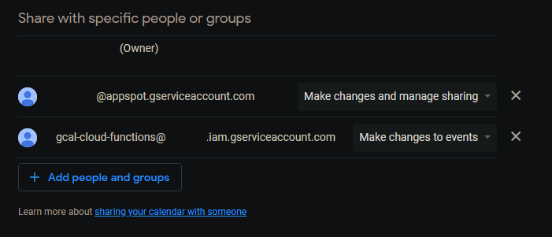

I couldn't find many resources on how to get around authorization for the google calendar API from inside a cloud function written in python, so I've put together this example to use as a template.

# Google Calendar API in Cloud Functions.

## Setup 

Clone the repo.

```sh
git clone https://github.com/ayvi-0001/example-py-gcal-api-cloud-function
```

Setup virtualenv.

```sh
virtualenv example-py-gcal-api-cloud-function

cd example-py-gcal-api-cloud-function && cd Scripts && activate.bat && cd ..

pip install -r requirements.txt
```

### Service Account Authorization
The Google Calendar API _must_ use OAuth 2.0 to authorize requests and does not support any other authorization protocols.  
Since the function can't authorize the app through a consent screen, we need to share our calendar with a service account email, and use that service account for credentials.

In GCP, go to APIs & Services > Credentials.  
You can either use the App Engine default service account or create a custom service account with the necessary Cloud Functions permissions.  
Create/download a key for the service account, and save it in the working directory as `credentials.json`.

<p align="center">
   
   
</p>

### Google Calendar Share/Settings
1. Go to the settings menu in your google calendar (gear icon top right corner) 
2. Click `Settings for my calendar`. 
3. Select the calendar you want to share.
4. In Calendar settings, under `Share with specific people or groups`, click `+ Add people and groups` 
5. Add your service account email with the permissions "See all event details" at a minimum 
6. Click `Send`.

<p align="center">  <br> </p>

### Configure
To access your events from the service account, the `calendarID` parameter in `service.events().list()` needs to be set to your primary email used in google calendar. This is normally set to "primary".

In the `.env.yaml` file, set the following environment variables:  
- PRIMARY_CALENDAR_EMAIL: your primary email used for google calendar.
- TZ: your timezone, e.g. America/Vancouver

### Local Tests
To test locally before deploying your cloud function, you can use the `main.py` file in `local-test`.
The object that will get passed to your entry point when it's running is a flask `Request`, which has the property `data` in bytes. The file in `local-test` is altered slightly to pass a dictionary.

Rewrite code to your application. The default behaviour for the example function will print all events from today. Increase the amount by passing a payload with keys `"timedelta"` and `"days"` | `"weeks"`.

### Deploy

Update the main script in the source directory (the `local-test` dir is included in `.gcloudignore` and won't upload to your function).  
[Update the arguments to `gcloud functions deploy`](https://cloud.google.com/sdk/gcloud/reference/functions/deploy) in `deploy.bat` (name, region, memory, etc..) and run. If you haven't already installed the gcloud CLI, view [installation instructions here](https://cloud.google.com/sdk/docs/install), or deploy your function [via the UI](https://console.cloud.google.com/functions/list).


Test your function. _Example call - rewrite to your project name/region_:

```sh
curl -m 550 -v https://${REGION}-${PROJECTID}.cloudfunctions.net/example-cf-gcal-api -H "Content-Type: application/json" -d "{\"timedelta\":{\"weeks\":2}}"
```

---

## Code

```py
import json
import os
from datetime import datetime, timedelta

import functions_framework
import pytz
from flask import Request
from google.oauth2 import service_account
from googleapiclient.discovery import build
from googleapiclient.errors import HttpError


@functions_framework.http
def main(request: Request) -> str:
    data = json.loads(request.data)

    credentials = service_account.Credentials.from_service_account_file(
        "credentials.json",
        scopes=["https://www.googleapis.com/auth/calendar.readonly"],
    )

    try:
        service = build(
            "calendar", "v3", credentials=credentials, cache_discovery=False
        )

        tz_info = pytz.timezone(os.environ["TZ"])
        today = datetime.today().astimezone(tz_info)

        timeMin = today.replace(hour=0, minute=0, second=0, microsecond=0)
        timeMax = today.replace(hour=23, minute=59, second=59, microsecond=999999)

        if data and "timedelta" in data:
            match data["timedelta"]:
                case {"days": float}:
                    timeMax += timedelta(days=data["timedelta"]["days"])
                case {"weeks": float}:
                    timeMax += timedelta(weeks=data["timedelta"]["weeks"])

        events_list = (
            service.events()
            .list(
                calendarId=os.environ["PRIMARY_CALENDAR_EMAIL"],
                timeMin=timeMin.isoformat(),
                timeMax=timeMax.isoformat(),
                singleEvents=True,
                orderBy="startTime",
                # additional available fields:
                # maxResults=2500,
                # ^ The page size can never be larger than 2500 events. Optional.
                # q="string search terms",
                # ^ Free text search terms to find events that match these terms in the following fields:
                #   summary, description, location, attendee's displayName, attendee's email. Optional.
            )
            .execute()
        )

        events = events_list.get("items", [])

        if not events:
            return "No upcoming events found."

        for event in events:
            start = datetime.fromisoformat(event["start"]["dateTime"])
            end = datetime.fromisoformat(event["end"]["dateTime"])
            title = event["summary"]

            # do something with events...
            print("%s - %s: %s" % (start, end, title))

        return "Done."

    except HttpError as e:
        return "An error occurred: %s" % e
```
